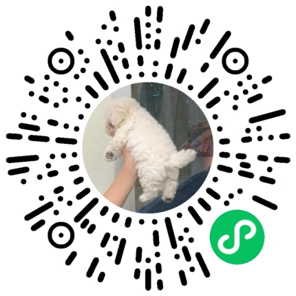
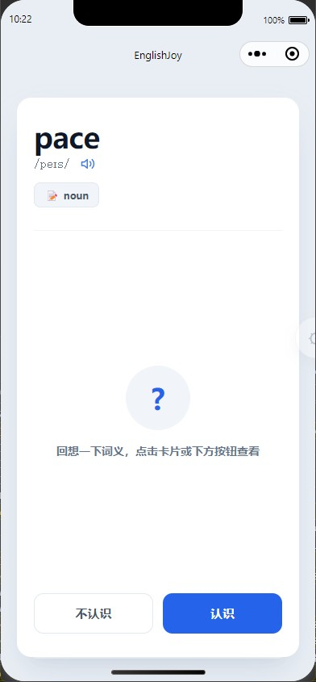
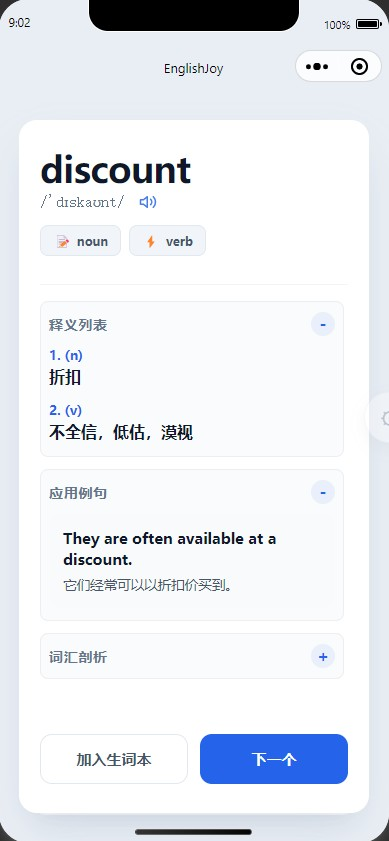
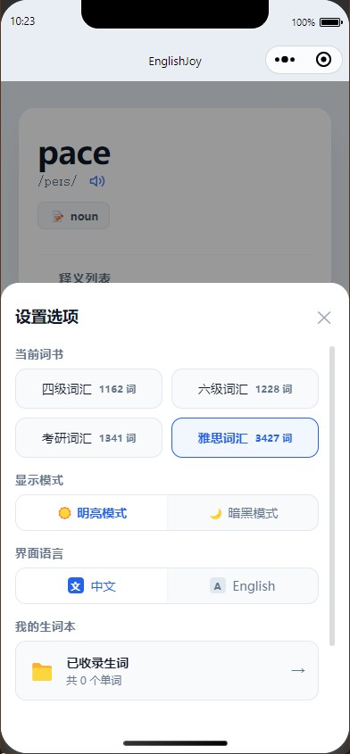
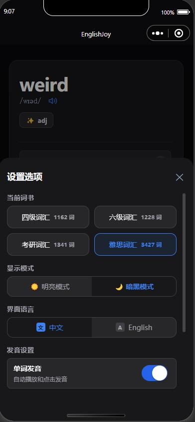

<div align="center">

# 📱 EnglishJoy
### — 极简 · 沉浸 · 纯粹的离线卡片背单词微信小程序 —

[](https://mp.weixin.qq.com/)
[-2B9939?style=flat-square&logo=vue.js&logoColor=white)](https://uniapp.dcloud.net.cn/)
[](https://www.typescriptlang.org/)
[](https://unocss.dev/)
[](https://github.com/lanzm/EnglishJoy)
[](LICENSE)

---

**EnglishJoy** 是一款专注于高效记忆的**极简卡片背单词**微信小程序。  
支持**完全自主部署**，让你拥有 100% 属于自己的背单词私有小程序。

摒弃任何社交、积分、任务、PK 等繁杂花哨的干扰，回归记忆卡片（Flashcards）最纯粹的本源。通过**像刷短视频一样流畅的上下滑手势刷单词**，提供绝对专注、秒级启动、**完全离线**的英语记忆空间，**特别适合需要集中、高频、大量记忆词汇的快速突破场景**。

<br/>
<sub><b>微信扫码 即可体验</b></sub>

[💡 提交 Bug 与建议](https://github.com/lanzm/EnglishJoy/issues) · [📖 词书资源说明](#-词书资源说明) · [🛠️ 开发者运行部署](#-开发者运行与部署)

</div>

---

## 📸 视觉预览 (Visual Preview)

<div align="center">
  <table border="0">
    <tr>
      <td align="center" valign="bottom">
        <br/>
        <sub><b>卡片主界面 (Light)</b></sub>
      </td>
      <td align="center" valign="bottom">
        <br/>
        <sub><b>释义与剖析 (Detail)</b></sub>
      </td>
      <td align="center" valign="bottom">
        <br/>
        <sub><b>设置菜单 (Light)</b></sub>
      </td>
      <td align="center" valign="bottom">
        <br/>
        <sub><b>设置菜单 (Dark)</b></sub>
      </td>
    </tr>
  </table>
</div>

---

## 🌟 核心特性 (Key Features)

### 🛠️ 自主部署，专属私有 (Self-Hosted & Private)
- **属于你自己的小程序**：支持完全自主部署与定制，只需拥有一个微信小程序账号，即可几步部署出 100% 属于你自己的背单词小程序，完全自主掌控。
- **数据隐私绝对安全**：所有词书与背诵进度完全保留在本地，无任何后端服务器上传，隐私无忧。

### 📦 100% 零网络依赖 (Offline-First)
- **完全离线运行**：内置 **CET4、CET6、考研、雅思** 四本核心词书，本地数据一次性载入，彻底摆脱断网断词的尴尬。（*注：单词真人发音朗读功能需连接网络以获取有道免费语音接口支持*）
- **本地高效解析**：释义列表、构词法剖析、中英例句对比等核心逻辑完全在本地执行，秒级响应。

### 📱 拟真层叠卡片交互 (Flashcard Interaction)
- **像刷短视频一样刷单词**：支持流畅的垂直手势拖拽（向上划过进入下一词，向下拖拽退回上一词温习）。交互顺滑跟手，体验如同刷短视频，极易进入“心流”状态，特别适合集中、大量词汇的快速记忆。
- **3D 叠层视差**：采用层叠 DOM 卡片结构，底层卡片与前景卡片形成视差深度感。
- **简/繁详情切换**：轻触卡片即可翻面展现单词发音、详细翻译、构词逻辑与真实例句。

### 🎓 科学学术深度剖析 (Word Anatomy)
- **音节智能测算**：依据音位学规则智能剥离词尾静音，精确计算并展现单词音节数，辅助读音辅助记忆。
- **星级难度评估**：基于词频、词长与当前词书属性，为词汇评估出 1-5 星记忆难度。
- **词尾派生构词分析**：自动识别并剥离主流学术词尾（如 `-tion`、`-ness` 等）并分析语法词性，若无后缀则自动生成该词的元辅音占比统计。

### ⚙️ 极致的设计美学与定制
- **系统级暗黑模式**：全页面无缝适配系统主题色转换，支持亮/暗主题平滑渐变切换。
- **完美兼容无感 i18n**：界面支持一键中英双语实时切换，首创“文/A”微章样式替换传统国旗图标，规避真机不同平台系统国旗 Emoji 渲染差异。
- **高弹性包体积控制**：采用 **运行时动态 Proxy 文件代理技术**，配合 `readFileSync` 在小程序内按需同步读取静态词书，替代 ES6 静态打包，将主包体积压缩 **50%**，安全躲过 2MB 限制线。

---

## 🛠️ 开发者运行与部署 (Development)

### 1. 准备工作
克隆项目到本地：
```bash
git clone https://github.com/lanzm/EnglishJoy.git
cd EnglishJoy
```

安装项目依赖（推荐使用 `pnpm` 或 `npm`）：
```bash
npm install
# 或者使用 pnpm
pnpm install
```

### 2. 开发者运行
* **编译微信小程序**：
  ```bash
  npm run dev:mp-weixin
  ```
* **运行调试**：
  打开**微信开发者工具**，点击“导入项目”，选择项目根目录下的 `dist/dev/mp-weixin` 即可实时进行预览和调试。

### 3. 生成发布生产包
编译生产包：
```bash
npm run build:mp-weixin
```
编译成功后，在微信开发者工具中导入 `dist/build/mp-weixin` 目录，检查无误后，点击“上传”按钮提交至微信小程序后台进行审核发布。

### 4. ⚠️ 微信服务器域名白名单配置 (Domain Whitelist)

由于小程序发音功能依赖有道 TTS 语音接口，为确保**真机运行/正式版中语音发音功能正常**，您必须在微信小程序管理后台配置服务器安全域名：

1. 登录 [微信公众平台 (mp.weixin.qq.com)](https://mp.weixin.qq.com/)。
2. 进入 **「开发」 -> 「开发管理」 -> 「开发设置」 -> 「服务器域名」**。
3. 在 **`request 合法域名`** 中，添加有道语音发音接口域名：
   ```text
   https://dict.youdao.com
   ```

> [!TIP]
> 在微信开发者工具中调试时，可勾选 **「详情 -> 本地设置 -> 不校验合法域名、web-view（业务域名）、TLS版本以及HTTPS证书」** 进行本地测试，但真机发布前必须完成上述合法域名配置。

---

## 📖 词书资源说明 (Wordbooks)

静态词书资源文件存放在 `src/static/` 下：
*   **CET-4** (`CET4luan_1.json`)：大学英语四级乱序核心词
*   **CET-6** (`CET6luan_1.json`)：大学英语六级乱序核心词
*   **考研英语** (`KaoYanluan_1.json`)：考研英语大纲高频核心词
*   **雅思考试** (`IELTSluan_2.json`)：雅思考试核心词汇及派生词

每个单词的存储数据结构高度精简，最大限度压缩离线体积：
```json
{
  "w": "access",                                    // 单词
  "p": "'ækses",                                    // 英音/美音音标
  "t": [["v", "获取"], ["n", "接近，入口"]],         // 词性与释义
  "s": [                                            // 中英双语真实学术例句
    ["Users can access their voice mail remotely.", "用户可以远程获取语音邮件。"]
  ]
}
```

---

## 🤝 许可证 (License)

本项目基于 [MIT License](LICENSE) 协议开源。欢迎在此基础上二次开发或进行非商业性与商业性二次分发。
